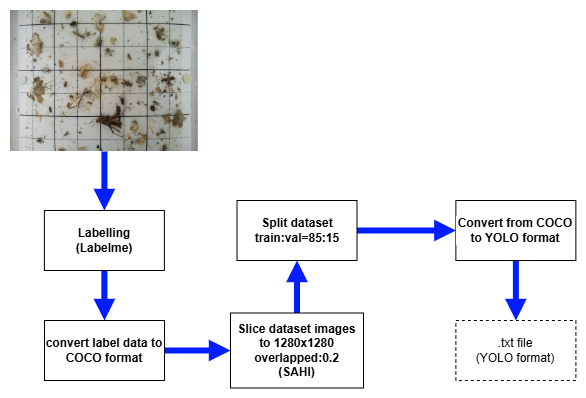

# InsectDetectorAHDP
This respository is created for the paper: High-Precision Detection of Homona Magnanima and Adoxophyes Honmai in Mandarin Orchards Using Deep Learning

  
  
	
Graphical Abstract.

# Google drive link to Phenomics Lab Tree Instance Segmentation (PTIS) dataset

  	
	
Preprocesing data pipeline.

All Preproceeded data for training:
https://drive.google.com/drive/folders/1NX6_uJpPUABk7d0NakaLj9kD3N5wpoKI?usp=sharing

  	
	
Experiment set up.

# Dependency
Package            Version
------------------ --------------------
certifi            2023.5.7
charset-normalizer 3.1.0
colorama           0.4.6
contourpy          1.0.7
cycler             0.11.0
filelock           3.12.0
fonttools          4.39.4
idna               3.4
imgviz             1.7.3
Jinja2             3.1.2
joblib             1.3.1
kiwisolver         1.4.4
labelme            5.2.1
labelme2yolo       0.1.2
MarkupSafe         2.1.2
matplotlib         3.7.1
mpmath             1.3.0
natsort            8.4.0
networkx           3.1
numpy              1.24.3
opencv-python      4.7.0.72
packaging          23.1
pandas             2.0.2
Pillow             9.5.0
pip                23.1.2
psutil             5.9.5
py-cpuinfo         9.0.0
pyparsing          3.0.9
PyQt5              5.15.9
PyQt5-Qt5          5.15.2
PyQt5-sip          12.12.2
python-dateutil    2.8.2
pytz               2023.3
PyYAML             6.0
QtPy               2.3.1
requests           2.31.0
scikit-learn       1.2.2
scipy              1.10.1
seaborn            0.12.2
setuptools         67.7.2
six                1.16.0
sympy              1.12
termcolor          2.3.0
thop               0.1.1.post2209072238
threadpoolctl      3.2.0
torch              2.0.1
torchaudio         2.0.2+cu117
torchvision        0.15.2
tqdm               4.65.0
typing_extensions  4.6.2
tzdata             2023.3
ultralytics        8.1.14
urllib3            2.0.2
wheel              0.40.0
yolo2labelme       0.0.4

# Pretrained model of YOLOv11 
You can download pretrained model from here: https://drive.google.com/file/d/1mvm33mm974NCv0KOQbhKAXF-0yr6sov7/view?usp=sharing

# Citation
If this code helps your research, please cite our paper:

	@inproceedings{thaiplantphenomics,
		title={High-Precision Detection of Homona Magnanima and Adoxophyes Honmai in Mandarin Orchards Using Deep Learning},
		author={Soon Hwa Kwon, Yong Suk Chung, Jinhyun Ahn, Kyung Jin Park, and Thanh Tuan Thai},
		booktitle={},
		pages={},
		year={}
	}
# License
ADOXMonitoring is freely available for free non-commercial use, and may be redistributed under these conditions. Please, see the [license](./LICENSE) for further details. For commercial queries, please contact [Prof.Yong Suk Chung](mailto:yschung@jejunu.ac.kr).
